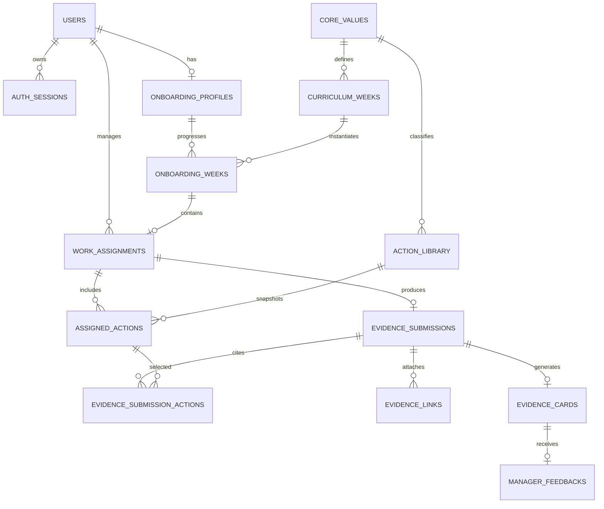

# IX Value Loop — 데이터 모델 계약

- 문서 상태: MVP 구현 기준안
- 대상 DB: PostgreSQL 16 이상
- 관련 문서:
  - `docs/API_CONTRACT.md`
  - `docs/LLM_CONTRACT.md`
  - `docs/STATE_TRANSITIONS.md`

이 문서는 개발계획서보다 구체적인 DB 구현 계약이다. 테이블명, 컬럼 의미,
관계, 유일성 및 삭제 정책은 구현 전에 이 문서를 기준으로 확정한다.

## 1. MVP 카디널리티

MVP에서는 다음 관계를 고정한다.

```text
신규 입사자 1명
  └─ 온보딩 12주
      └─ 주차별 대표 업무 최대 1개
          ├─ 배정 Action 2~5개
          └─ Evidence 최대 1개
              └─ Evidence Card 최대 1개
                  └─ 팀장 최종 피드백 최대 1개
```

추후 한 주에 여러 업무를 지원할 수 있지만 MVP에서는
`work_assignments.onboarding_week_id`를 unique로 제한한다.

## 2. 공통 규칙

### 2.1 식별자와 시간

- 모든 PK는 애플리케이션에서 생성한 UUID v4를 사용한다.
- 모든 timestamp는 PostgreSQL `timestamptz`로 UTC 저장한다.
- API는 ISO 8601 UTC 문자열을 반환한다. 예: `2026-07-31T04:10:22Z`
- 입사일, 시작일, 마감일은 `date`로 저장한다.
- 주차 계산의 업무 기준 시간대는 `Asia/Seoul`이다.
- 모든 테이블명과 컬럼명은 `snake_case`를 사용한다.

### 2.2 공통 컬럼

변경 가능한 주요 테이블에는 다음 컬럼을 둔다.

| 컬럼 | 타입 | 규칙 |
|---|---|---|
| `id` | `uuid` | PK |
| `created_at` | `timestamptz` | `NOT NULL`, DB default `now()` |
| `updated_at` | `timestamptz` | `NOT NULL`, 변경 시 애플리케이션에서 갱신 |
| `version` | `integer` | `NOT NULL DEFAULT 1`, 낙관적 잠금이 필요한 테이블에 사용 |

### 2.3 삭제 정책

- 데모 진행 데이터는 사용자 삭제 시 cascade할 수 있다.
- `core_values`, `curriculum_weeks`, `action_library`는 참조 중이면 삭제하지 않고
  `is_active=false`로 비활성화한다.
- Evidence가 생성된 업무와 배정 Action은 일반 API로 삭제할 수 없다.
- 공개 reset API는 만들지 않는다.

## 3. Enum

PostgreSQL enum 또는 SQLAlchemy enum으로 다음 값을 사용한다. 구현 시 문자열 값은
아래 표와 정확히 일치해야 한다.

| Enum | 값 |
|---|---|
| `user_role` | `employee`, `manager`, `hr` |
| `onboarding_stage` | `guided`, `assisted`, `autonomous` |
| `work_type` | `user_interview`, `process_analysis`, `problem_definition`, `data_analysis`, `service_planning`, `prototype_build`, `user_validation`, `collaboration`, `result_improvement` |
| `assignment_status` | `active`, `completed`, `cancelled` |
| `action_source_kind` | `library`, `custom` |
| `action_status` | `pending`, `completed` |
| `evidence_card_status` | `ai_processing`, `generation_failed`, `user_review`, `user_confirmed`, `manager_reviewed` |
| `ai_provider` | `groq`, `mock` |

직무 코드는 조직 변경 가능성이 높으므로 DB enum으로 만들지 않고
정규화된 `varchar(50)`을 사용한다. 예: `ax`, `pm`, `developer`, `hr`.

## 4. 관계도



## 5. 테이블 정의

### 5.1 `users`

로그인 주체와 역할을 저장한다.

| 컬럼 | 타입 | 제약/설명 |
|---|---|---|
| `id` | `uuid` | PK |
| `name` | `varchar(100)` | `NOT NULL` |
| `email` | `varchar(254)` | `NOT NULL` |
| `normalized_email` | `varchar(254)` | `NOT NULL UNIQUE`, trim 후 소문자 |
| `password_hash` | `varchar(255)` | `NOT NULL`, Argon2id |
| `role` | `user_role` | `NOT NULL` |
| `is_active` | `boolean` | `NOT NULL DEFAULT true` |
| `demo_fixture_key` | `varchar(100)` | nullable unique, 데모 대상 식별 |
| `created_at` | `timestamptz` | `NOT NULL` |
| `updated_at` | `timestamptz` | `NOT NULL` |

규칙:

- 로그인 조회는 `normalized_email`만 사용한다.
- 역할 변경은 MVP 관리 API에서 제공하지 않는다.
- seed 계정 비밀번호도 평문 저장하지 않는다.

### 5.2 `auth_sessions`

Autoscale 다중 인스턴스에서도 동작하는 서버 측 세션이다.

| 컬럼 | 타입 | 제약/설명 |
|---|---|---|
| `id` | `uuid` | PK |
| `user_id` | `uuid` | FK `users.id`, `ON DELETE CASCADE` |
| `token_hash` | `char(64)` | `NOT NULL UNIQUE`, 원본 토큰의 SHA-256 |
| `csrf_token_hash` | `char(64)` | `NOT NULL`, 원본 CSRF 토큰의 SHA-256 |
| `expires_at` | `timestamptz` | `NOT NULL` |
| `revoked_at` | `timestamptz` | nullable |
| `last_seen_at` | `timestamptz` | `NOT NULL` |
| `created_at` | `timestamptz` | `NOT NULL` |

규칙:

- 원본 세션 토큰과 CSRF 토큰은 DB나 로그에 저장하지 않는다.
- 유효 조건은 `revoked_at IS NULL AND expires_at > now()`이다.
- 로그아웃 시 행을 삭제하지 않고 `revoked_at`을 기록한다.

### 5.2.1 `auth_rate_limits`

Autoscale 인스턴스가 여러 개여도 일관된 로그인 실패 제한을 적용한다. 이메일이나
IP 원문은 저장하지 않고 서버 secret을 이용한 HMAC 결과만 저장한다.

| 컬럼 | 타입 | 제약/설명 |
|---|---|---|
| `id` | `uuid` | PK |
| `subject_hash` | `char(64)` | `NOT NULL UNIQUE`, normalized email + client IP의 HMAC |
| `window_started_at` | `timestamptz` | `NOT NULL` |
| `failure_count` | `smallint` | `NOT NULL DEFAULT 0` |
| `blocked_until` | `timestamptz` | nullable |
| `updated_at` | `timestamptz` | `NOT NULL` |

MVP 정책:

- 10분 window에서 실패 5회까지 허용
- 5회 초과 시 15분 차단
- 성공 로그인 시 해당 subject 행을 초기화
- 오래된 행은 로그인 요청 시 또는 관리 스크립트에서 정리

### 5.3 `onboarding_profiles`

신규 입사자의 온보딩 기준 정보다.

| 컬럼 | 타입 | 제약/설명 |
|---|---|---|
| `id` | `uuid` | PK |
| `user_id` | `uuid` | FK `users.id`, `NOT NULL UNIQUE`, cascade |
| `job_role` | `varchar(50)` | `NOT NULL`, 소문자 코드 |
| `start_date` | `date` | `NOT NULL` |
| `manager_id` | `uuid` | FK `users.id`, `NOT NULL`, restrict |
| `demo_week_override` | `smallint` | nullable, check `1..12` |
| `created_at` | `timestamptz` | `NOT NULL` |
| `updated_at` | `timestamptz` | `NOT NULL` |

`not_started`, `active`, `completed` 상태는 저장하지 않고 기준 날짜와
`start_date`로 계산한다.

### 5.4 `core_values`

12개 공식 핵심가치를 저장한다.

| 컬럼 | 타입 | 제약/설명 |
|---|---|---|
| `id` | `uuid` | PK |
| `code` | `varchar(50)` | `NOT NULL UNIQUE`, 변경하지 않는 영문 코드 |
| `name` | `varchar(100)` | `NOT NULL UNIQUE` |
| `short_description` | `varchar(300)` | `NOT NULL` |
| `full_description` | `text` | `NOT NULL` |
| `display_order` | `smallint` | `NOT NULL UNIQUE`, check `1..12` |
| `is_active` | `boolean` | `NOT NULL DEFAULT true` |
| `created_at` | `timestamptz` | `NOT NULL` |
| `updated_at` | `timestamptz` | `NOT NULL` |

### 5.5 `curriculum_weeks`

공식 12주 커리큘럼이다.

| 컬럼 | 타입 | 제약/설명 |
|---|---|---|
| `id` | `uuid` | PK |
| `week_number` | `smallint` | `NOT NULL UNIQUE`, check `1..12` |
| `core_value_id` | `uuid` | FK `core_values.id`, `NOT NULL UNIQUE`, restrict |
| `stage` | `onboarding_stage` | `NOT NULL` |
| `created_at` | `timestamptz` | `NOT NULL` |
| `updated_at` | `timestamptz` | `NOT NULL` |

단계 규칙:

- 1~4주: `guided`
- 5~8주: `assisted`
- 9~12주: `autonomous`

### 5.6 `onboarding_weeks`

특정 신규 입사자에게 적용된 주차 스냅숏이다. 커리큘럼이 나중에 변경되어도
과거 기록의 가치와 단계가 변하지 않도록 `core_value_id`와 `stage`를 함께 보존한다.

| 컬럼 | 타입 | 제약/설명 |
|---|---|---|
| `id` | `uuid` | PK |
| `profile_id` | `uuid` | FK `onboarding_profiles.id`, cascade |
| `week_number` | `smallint` | `NOT NULL`, check `1..12` |
| `curriculum_week_id` | `uuid` | FK `curriculum_weeks.id`, restrict |
| `core_value_id` | `uuid` | FK `core_values.id`, restrict, 스냅숏 |
| `stage` | `onboarding_stage` | `NOT NULL`, 스냅숏 |
| `starts_on` | `date` | `NOT NULL` |
| `ends_on` | `date` | `NOT NULL`, `starts_on + 6일` |
| `created_at` | `timestamptz` | `NOT NULL` |

제약:

- unique `(profile_id, week_number)`
- check `ends_on >= starts_on`

### 5.7 `work_assignments`

팀장이 배정한 실제 업무다.

| 컬럼 | 타입 | 제약/설명 |
|---|---|---|
| `id` | `uuid` | PK |
| `onboarding_week_id` | `uuid` | FK `onboarding_weeks.id`, `NOT NULL UNIQUE`, cascade |
| `employee_id` | `uuid` | FK `users.id`, `NOT NULL`, restrict |
| `manager_id` | `uuid` | FK `users.id`, `NOT NULL`, restrict |
| `title` | `varchar(200)` | `NOT NULL` |
| `description` | `text` | `NOT NULL`, 최대 2,000자 |
| `work_type` | `work_type` | `NOT NULL` |
| `start_date` | `date` | `NOT NULL` |
| `due_date` | `date` | `NOT NULL` |
| `status` | `assignment_status` | `NOT NULL DEFAULT 'active'` |
| `seed_key` | `varchar(100)` | nullable unique |
| `created_at` | `timestamptz` | `NOT NULL` |
| `updated_at` | `timestamptz` | `NOT NULL` |

규칙:

- `employee_id`는 연결된 profile의 사용자와 같아야 한다.
- MVP에서는 `manager_id`가 profile의 `manager_id`와 같아야 한다.
- 위 두 규칙은 service 계층과 테스트에서 검증한다.

### 5.8 `action_library`

검증된 Value Action 원본이다. nullable 조건은 “전사 공통” wildcard를 뜻한다.

| 컬럼 | 타입 | 제약/설명 |
|---|---|---|
| `id` | `uuid` | PK |
| `library_key` | `varchar(120)` | `NOT NULL UNIQUE`, seed/upsert 식별자 |
| `core_value_id` | `uuid` | FK `core_values.id`, `NOT NULL`, restrict |
| `job_role` | `varchar(50)` | nullable, null이면 직무 공통 |
| `work_type` | `work_type` | nullable, null이면 업무 유형 공통 |
| `onboarding_stage` | `onboarding_stage` | nullable, null이면 단계 공통 |
| `action_text` | `text` | `NOT NULL`, 최대 1,000자 |
| `recommended_evidence` | `jsonb` | `NOT NULL`, 문자열 배열, 최대 5개 |
| `completion_criteria` | `text` | `NOT NULL`, 최대 1,000자 |
| `priority` | `smallint` | `NOT NULL DEFAULT 100`, 낮을수록 우선 |
| `is_active` | `boolean` | `NOT NULL DEFAULT true` |
| `created_at` | `timestamptz` | `NOT NULL` |
| `updated_at` | `timestamptz` | `NOT NULL` |

매칭 정렬:

1. `core_value_id`는 반드시 일치
2. 일치 조건 개수가 많은 Action 우선
3. `priority ASC`
4. `library_key ASC`
5. guided 단계에서는 상위 2~3개 배정

### 5.9 `assigned_actions`

실제 업무에 배정된 Action 스냅숏이다.

| 컬럼 | 타입 | 제약/설명 |
|---|---|---|
| `id` | `uuid` | PK |
| `assignment_id` | `uuid` | FK `work_assignments.id`, cascade |
| `source_kind` | `action_source_kind` | `NOT NULL` |
| `source_action_id` | `uuid` | nullable FK `action_library.id`, restrict |
| `created_by_user_id` | `uuid` | nullable FK `users.id`, restrict |
| `action_text_snapshot` | `text` | `NOT NULL`, 최대 1,000자 |
| `completion_criteria_snapshot` | `text` | `NOT NULL`, 최대 1,000자 |
| `recommended_evidence_snapshot` | `jsonb` | `NOT NULL`, 문자열 배열 |
| `is_required` | `boolean` | `NOT NULL DEFAULT true` |
| `display_order` | `smallint` | `NOT NULL` |
| `status` | `action_status` | `NOT NULL DEFAULT 'pending'` |
| `completed_at` | `timestamptz` | nullable |
| `created_at` | `timestamptz` | `NOT NULL` |
| `updated_at` | `timestamptz` | `NOT NULL` |
| `version` | `integer` | `NOT NULL DEFAULT 1` |

제약:

- unique `(assignment_id, display_order)`
- `source_kind='library'`이면 `source_action_id IS NOT NULL`
- `source_kind='custom'`이면 `created_by_user_id IS NOT NULL`
- `status='completed'`이면 `completed_at IS NOT NULL`
- `status='pending'`이면 `completed_at IS NULL`
- library Action에 대해서만 partial unique `(assignment_id, source_action_id)`

### 5.10 `evidence_submissions`

신규 입사자가 제출한 행동 근거다. MVP에서는 제출 후 수정하지 않는다.

| 컬럼 | 타입 | 제약/설명 |
|---|---|---|
| `id` | `uuid` | PK |
| `assignment_id` | `uuid` | FK `work_assignments.id`, `NOT NULL UNIQUE`, cascade |
| `employee_id` | `uuid` | FK `users.id`, `NOT NULL`, restrict |
| `performed_action` | `text` | `NOT NULL`, 10~2,000자 |
| `discovery` | `text` | `NOT NULL`, 10~2,000자 |
| `changed_judgment` | `text` | `NOT NULL`, 10~2,000자 |
| `work_impact` | `text` | `NOT NULL`, 10~2,000자 |
| `next_action` | `text` | `NOT NULL`, 10~1,000자 |
| `submitted_at` | `timestamptz` | `NOT NULL` |
| `created_at` | `timestamptz` | `NOT NULL` |

서비스 검증:

- `employee_id`는 assignment의 employee와 같아야 한다.
- 모든 필수 Action이 완료되어야 한다.
- 선택 Action은 같은 assignment 소속이며 completed 상태여야 한다.

### 5.11 `evidence_submission_actions`

Evidence가 어떤 완료 Action을 근거로 삼았는지 저장한다.

| 컬럼 | 타입 | 제약/설명 |
|---|---|---|
| `evidence_id` | `uuid` | FK `evidence_submissions.id`, cascade |
| `assigned_action_id` | `uuid` | FK `assigned_actions.id`, restrict |

PK/unique: `(evidence_id, assigned_action_id)`

### 5.12 `evidence_links`

AI가 링크 내용을 가져오지 않는 참고 링크다.

| 컬럼 | 타입 | 제약/설명 |
|---|---|---|
| `id` | `uuid` | PK |
| `evidence_id` | `uuid` | FK `evidence_submissions.id`, cascade |
| `external_url` | `text` | `NOT NULL`, HTTP/HTTPS만 허용 |
| `title` | `varchar(200)` | `NOT NULL` |
| `description` | `varchar(1000)` | `NOT NULL` |
| `created_at` | `timestamptz` | `NOT NULL` |

서비스 제약:

- Evidence당 최대 3개
- URL 전체 길이 최대 2,048자
- `http`, `https` 외 scheme 거부
- 서버는 URL에 접속하거나 redirect를 확인하지 않는다.

### 5.13 `evidence_cards`

AI 최초 생성본과 신규 입사자의 최종 확정본을 분리 저장한다.

| 컬럼 | 타입 | 제약/설명 |
|---|---|---|
| `id` | `uuid` | PK |
| `evidence_id` | `uuid` | FK `evidence_submissions.id`, `NOT NULL UNIQUE`, cascade |
| `status` | `evidence_card_status` | `NOT NULL` |
| `generated_content_json` | `jsonb` | nullable, LLM/Mock 최초 결과 |
| `final_content_json` | `jsonb` | nullable, 사용자 편집본 |
| `generated_by` | `ai_provider` | nullable, 생성 성공 후 필수 |
| `model_name` | `varchar(100)` | nullable, Mock이면 null |
| `prompt_version` | `varchar(30)` | `NOT NULL` |
| `schema_version` | `varchar(30)` | `NOT NULL` |
| `generation_attempts` | `smallint` | `NOT NULL DEFAULT 0` |
| `generation_latency_ms` | `integer` | nullable |
| `last_error_code` | `varchar(50)` | nullable, 민감한 오류 본문 저장 금지 |
| `confirmed_at` | `timestamptz` | nullable |
| `manager_reviewed_at` | `timestamptz` | nullable |
| `created_at` | `timestamptz` | `NOT NULL` |
| `updated_at` | `timestamptz` | `NOT NULL` |
| `version` | `integer` | `NOT NULL DEFAULT 1` |

규칙:

- `user_review` 진입 시 generated/final JSON을 같은 최초 값으로 저장한다.
- 사용자는 `final_content_json`만 변경할 수 있다.
- `user_confirmed` 이후 두 JSON 모두 변경할 수 없다.
- JSON 형식은 `docs/LLM_CONTRACT.md`의 CardContentV1을 따른다.

### 5.14 `manager_feedbacks`

팀장의 최종 피드백이다. 제출 자체가 승인과 리포트 반영을 의미한다.

| 컬럼 | 타입 | 제약/설명 |
|---|---|---|
| `id` | `uuid` | PK |
| `evidence_card_id` | `uuid` | FK `evidence_cards.id`, `NOT NULL UNIQUE`, cascade |
| `manager_id` | `uuid` | FK `users.id`, `NOT NULL`, restrict |
| `observed_behavior` | `text` | `NOT NULL`, 10~1,000자 |
| `work_impact` | `text` | `NOT NULL`, 10~1,000자 |
| `positive_feedback` | `text` | `NOT NULL`, 10~1,000자 |
| `next_action` | `text` | `NOT NULL`, 10~1,000자 |
| `submitted_at` | `timestamptz` | `NOT NULL` |
| `created_at` | `timestamptz` | `NOT NULL` |

서비스 검증:

- manager는 assignment의 `manager_id`와 같아야 한다.
- Card가 `user_confirmed`일 때만 생성 가능하다.
- 생성과 Card의 `manager_reviewed` 변경은 한 DB transaction으로 처리한다.

## 6. 파생 상태

다음 값은 DB에 중복 저장하지 않고 조회 시 계산한다.

### 6.1 온보딩 전체 상태

```text
reference_date < start_date       -> not_started
0 <= elapsed_days <= 83           -> active
elapsed_days >= 84                -> completed
```

`demo_week_override`가 있으면 데모 화면의 현재 주차만 override하며, seed profile은
항상 active가 되도록 기준 날짜를 함께 고정한다.

### 6.2 주차 표시 상태

우선순위 순으로 계산한다.

```text
manager_reviewed Card 존재  -> completed
user_confirmed Card 존재     -> awaiting_manager
user_review Card 존재        -> reviewing_card
Evidence 존재                -> evidence_submitted
완료 Action 1개 이상         -> in_progress
업무 존재                    -> ready
업무 없음                    -> not_configured
미래 주차                    -> locked
```

## 7. 필수 인덱스

- `users(normalized_email)` unique
- `auth_sessions(token_hash)` unique
- `auth_sessions(user_id, expires_at)`
- `auth_rate_limits(subject_hash)` unique
- `auth_rate_limits(blocked_until)`
- `onboarding_profiles(manager_id)`
- `onboarding_weeks(profile_id, week_number)` unique
- `work_assignments(employee_id, status)`
- `work_assignments(manager_id, status)`
- `assigned_actions(assignment_id, status)`
- `evidence_cards(status, updated_at)`
- `manager_feedbacks(manager_id, submitted_at)`
- `action_library(core_value_id, is_active, priority)`

PostgreSQL은 FK 인덱스를 자동 생성하지 않으므로 조회에 사용되는 FK에는 명시적으로
인덱스를 만든다.

## 8. 트랜잭션 경계

다음 동작은 각각 하나의 DB transaction으로 처리한다.

1. Evidence 생성 + Evidence-Action 연결 + Evidence 링크 생성
2. Card 사용자 확정 + `confirmed_at` 기록
3. 팀장 피드백 생성 + Card `manager_reviewed` 전이
4. 데모 reset

Groq 네트워크 호출 중에는 DB transaction을 열린 상태로 유지하지 않는다.
`ai_processing` Card를 먼저 commit하고, 외부 호출 후 짧은 별도 transaction으로
결과를 저장한다.

## 9. Seed 및 reset 규칙

- 모든 seed는 stable key로 upsert한다.
- 사용자는 `demo_fixture_key`, 업무는 `seed_key`, Action Library는 `library_key`를 사용한다.
- reset 대상은 allowlist로 정의된 데모 fixture뿐이다.
- reset은 `APP_ENV=demo` 또는 `APP_ENV=test`에서만 실행한다.
- reset은 트랜잭션을 사용하며 실패 시 전체 rollback한다.
- core value와 curriculum은 삭제 후 재생성하지 않고 stable key로 upsert한다.
- 초기 데모 상태는 Action 3개 중 2개 완료, Evidence 미제출 상태로 둔다.
