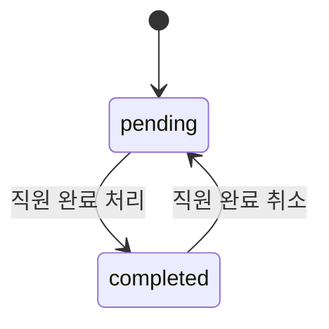
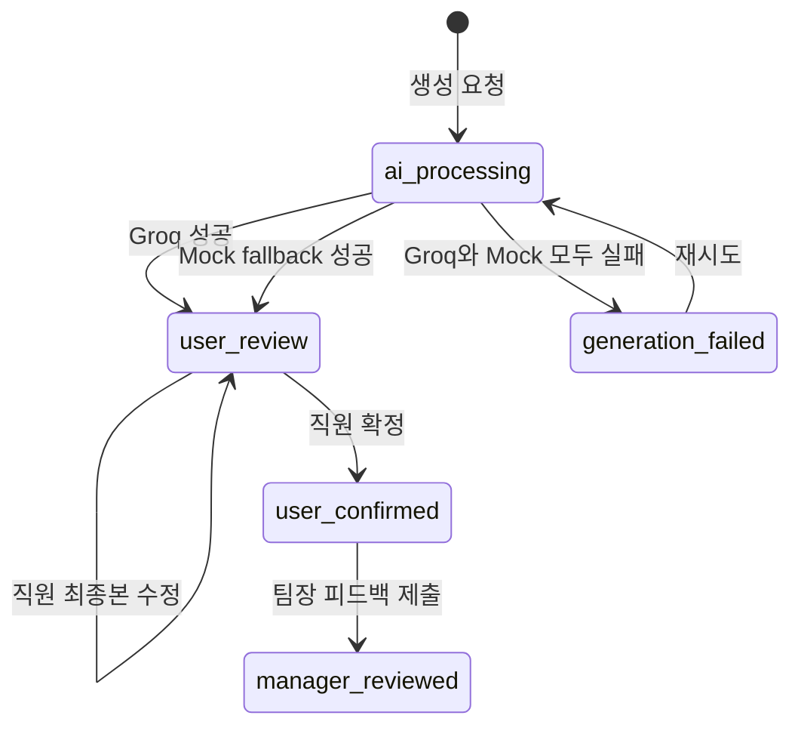
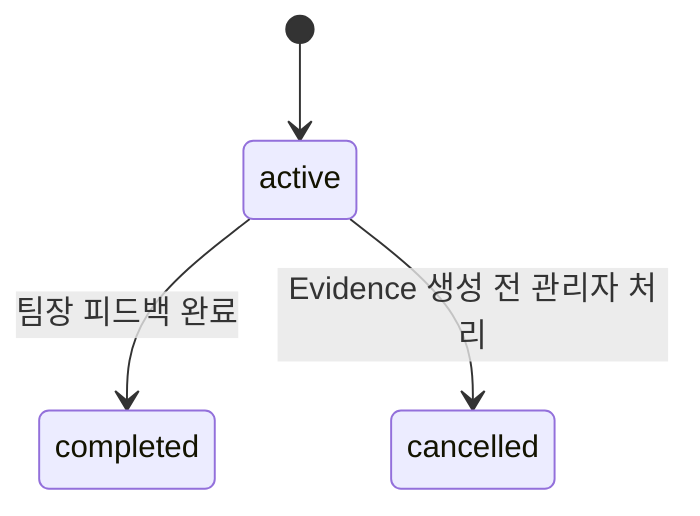

# IX Value Loop — 상태 전이 계약

- 문서 상태: MVP 구현 기준안
- 관련 문서:
  - `docs/DATA_MODEL.md`
  - `docs/API_CONTRACT.md`
  - `docs/LLM_CONTRACT.md`

상태 변경은 API route가 아니라 service 계층의 명시적인 transition 함수에서만 수행한다.
프론트엔드의 버튼 숨김은 보조 수단이며 서버가 모든 전이를 다시 검사한다.

## 1. Assigned Action

### 규칙

| 현재 상태 | 요청 상태 | 허용 조건 | 결과 |
|---|---|---|---|
| `pending` | `completed` | 본인 Action, assignment active, Evidence 없음 | `completed_at=now()` |
| `completed` | `pending` | 본인 Action, assignment active, Evidence 없음 | `completed_at=null` |
| 동일 | 동일 | 본인 Action | 멱등적으로 현재 리소스 반환 |

Evidence가 생성된 이후 Action은 잠긴다. 이때 상태 변경 요청은
`409 ACTION_LOCKED_BY_EVIDENCE`를 반환한다.

## 2. Evidence Submission

Evidence 자체에는 별도 상태를 두지 않는다.

생성 조건:

- 현재 사용자가 assignment의 employee다.
- assignment가 `active`다.
- 동일 assignment에 Evidence가 없다.
- 모든 `is_required=true` Action이 completed다.
- 요청의 Action ID가 해당 assignment에 속하고 completed다.
- 링크는 최대 3개이며 HTTP/HTTPS다.

같은 assignment로 다시 제출하면 `409 EVIDENCE_ALREADY_EXISTS`를 반환하고 기존
Evidence ID를 error details에 포함한다.

## 3. Evidence Card

### 상태별 허용 작업

| 상태 | 직원 조회 | 직원 편집 | 생성 재시도 | 직원 확정 | 팀장 피드백 |
|---|---:|---:|---:|---:|---:|
| `ai_processing` | O | X | X | X | X |
| `generation_failed` | O | X | O | X | X |
| `user_review` | O | O | X | O | X |
| `user_confirmed` | O | X | X | 멱등 | O |
| `manager_reviewed` | O | X | X | X | 멱등 |

### 생성 성공

Groq 또는 Mock이 정상 CardContentV1을 반환하면:

1. `generated_content_json`에 최초 결과 저장
2. `final_content_json`에 같은 결과 복사
3. 실제 provider와 model 기록
4. 상태를 `user_review`로 변경

Groq가 실패하고 Mock이 성공한 경우 실패 상태를 거치지 않는다.

### 생성 실패

다음 경우 Groq 실패로 간주한다.

- timeout
- 네트워크 오류
- HTTP 429
- HTTP 5xx
- 빈 응답
- JSON 파싱 실패
- Pydantic 검증 실패
- 허용되지 않은 source reference

Groq 재시도와 Mock 모두 실패한 경우에만 `generation_failed`로 변경한다.
사용자에게 내부 예외나 원문 stack trace를 반환하지 않는다.

### 사용자 수정

- `user_review`에서만 가능하다.
- `generated_content_json`은 변경하지 않는다.
- 요청의 `version`이 DB의 `version`과 일치해야 한다.
- 성공 시 `final_content_json`을 변경하고 `version += 1`한다.
- 불일치 시 `409 RESOURCE_VERSION_CONFLICT`와 최신 리소스를 반환한다.

### 사용자 확정

- `user_review`에서만 가능하다.
- final content를 CardContentV1로 다시 검증한다.
- 성공 시 `status=user_confirmed`, `confirmed_at=now()`, `version += 1`.
- 이미 `user_confirmed`인 Card에 동일 요청을 보내면 현재 Card를 반환한다.
- `manager_reviewed` Card의 확정 요청은 `409 INVALID_CARD_TRANSITION`.

### 팀장 피드백

- `user_confirmed`에서만 최초 제출 가능하다.
- assignment의 manager만 제출할 수 있다.
- feedback 생성과 Card 전이를 한 transaction으로 처리한다.
- 성공 시 `status=manager_reviewed`, `manager_reviewed_at=now()`.
- 동일 Card에 피드백이 이미 있으면 기존 피드백을 반환하는 멱등 동작으로 처리한다.
- MVP에서는 팀장 반려와 Card 본문 수정 기능을 제공하지 않는다.

## 4. Work Assignment

MVP UI에는 assignment 취소 기능을 제공하지 않지만 상태값은 데이터 모델에 둔다.

- Card가 `manager_reviewed`가 되면 assignment도 `completed`로 변경한다.
- Evidence가 생성된 assignment는 취소할 수 없다.
- completed/cancelled assignment의 Action과 Evidence는 변경할 수 없다.

## 5. 파생 주차 상태

주차 상태는 별도 컬럼으로 저장하지 않는다.

| 우선순위 | 조건 | API 상태 |
|---:|---|---|
| 1 | Card `manager_reviewed` | `completed` |
| 2 | Card `user_confirmed` | `awaiting_manager` |
| 3 | Card `user_review` | `reviewing_card` |
| 4 | Card `ai_processing` | `generating_card` |
| 5 | Card `generation_failed` | `generation_failed` |
| 6 | Evidence 존재 | `evidence_submitted` |
| 7 | 완료 Action 1개 이상 | `in_progress` |
| 8 | 업무 존재 | `ready` |
| 9 | 업무 없음 | `not_configured` |
| 10 | 미래 주차 | `locked` |

## 6. 권한 실패와 상태 실패 구분

| 상황 | HTTP | 오류 코드 |
|---|---:|---|
| 로그인 없음/세션 만료 | 401 | `AUTH_REQUIRED` |
| 역할이 맞지 않음 | 403 | `ROLE_FORBIDDEN` |
| 다른 직원/팀장의 리소스 | 404 | `RESOURCE_NOT_FOUND` |
| 입력 검증 실패 | 422 | `VALIDATION_ERROR` |
| 허용되지 않은 상태 전이 | 409 | `INVALID_CARD_TRANSITION` |
| 낙관적 잠금 충돌 | 409 | `RESOURCE_VERSION_CONFLICT` |
| 이미 존재하는 Evidence | 409 | `EVIDENCE_ALREADY_EXISTS` |

다른 사용자의 ID를 전달한 경우 실제 리소스 존재 여부를 노출하지 않기 위해 403이
아니라 404를 사용한다.

## 7. 동시 요청 처리

- Evidence 생성: `assignment_id` unique로 중복 차단
- Card 생성: `evidence_id` unique로 중복 차단
- Card 수정/확정: `version`으로 낙관적 잠금
- 팀장 피드백: `evidence_card_id` unique로 중복 차단
- unique 충돌은 DB 오류를 그대로 노출하지 않고 도메인 409 오류로 변환

## 8. 상태 전이 테스트 필수 목록

1. pending Action 완료 및 완료 취소
2. Evidence 이후 Action 변경 차단
3. 필수 Action 미완료 상태의 Evidence 제출 차단
4. 동일 assignment의 Evidence 중복 제출
5. Card 생성 성공
6. Groq 실패 후 Mock 성공
7. Groq와 Mock 모두 실패
8. generation_failed 재시도
9. user_review에서 최종본 수정
10. 오래된 version으로 수정 시 충돌
11. 확정 이후 수정·재생성 차단
12. 다른 팀장의 피드백 차단
13. 피드백 중복 제출 멱등 처리
14. manager_reviewed Card만 리포트에 포함
